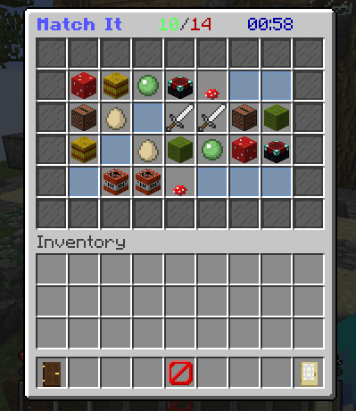

# Match It

Match It is an inventory game for the Spigot plugin [GameBox]. It is distributed in the GameBox jar which is published on [Spigot](https://www.spigotmc.org/resources/37273/).

Match It is a memory game and comes in three different grid sizes small, medium and large. All items and messages are configurable.

[GameBox]: https://github.com/NiklasEi/GameBox